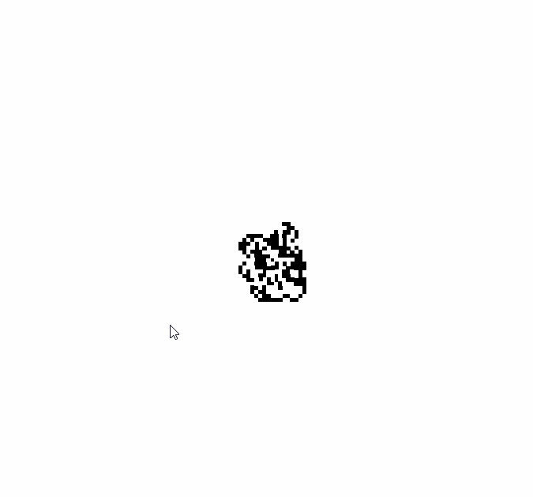

# Fourmi_de_Langton
[- article du projet](https://www.blogrudydavid.fr//Articles/Programmation/Fourmi_de_Langton18207.php)  

On nomme fourmi de Langton un automate cellulaire (voir machine de Turing) bidimensionnel comportant un jeu de règles très simples.

